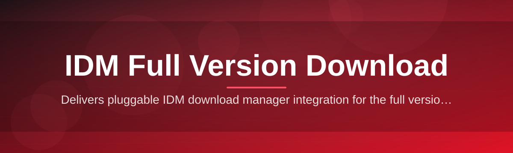
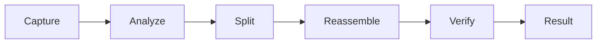

# idm-full-suite 🚀⚡

  

*A community-built launchpad that turns the sprawling world of download managers into a single, well-documented doorway.*

  

---

### ⏱️ 3-Step Quick Start

1. **Visit** the landing page via the download button below.

2. **Grab** the latest build for your Windows version.

3. **Run** the installer and start managing downloads at full throttle.

---

## 🛰️ Overview

`idm-full-suite` is a community-maintained hub built around one goal: making **IDM Full Version Download** simple, transparent, and safe to understand for everyone — from first-time GitHub visitors to seasoned contributors who like tinkering with download-acceleration tooling. Rather than scattering documentation, changelogs, and troubleshooting threads across a dozen forums, this repository consolidates everything into a single, versioned, and searchable project home.

Download managers occupy a weird niche — everyone uses one at some point, yet very few projects document *how* multi-connection downloading, queue scheduling, or resume-after-interrupt logic actually works under the hood. This suite exists to close that gap. We treat the IDM Full Version Download experience as a product: something that deserves clear release notes, a real requirements matrix, and an approachable onboarding flow instead of a shady link buried in a comment section.

Whether you're a student trying to grab large lecture archives reliably, a developer curious about download-segmentation algorithms, or a first-time open-source contributor looking for a **good-first-issue** to cut your teeth on, this project is built for you. We welcome pull requests, documentation fixes, translated guides, and UI polish equally — no contribution is too small.

---

## 🌟 The Feature That Steals the Show

**Adaptive Multi-Stream Acceleration** — the headline act. Instead of pulling a file through one thin connection, the suite intelligently splits eligible downloads into parallel streams and reassembles them on the fly, often turning a sluggish transfer into a near-instant one. This single capability is the reason most people go looking for an IDM Full Version Download in the first place, and it's the engine every other feature in this suite is built around.

> [!TIP]
> Large files (ISO images, archive bundles, video lectures) benefit the most from stream-splitting. Tiny files see little difference — that's expected, not a bug.

### More capabilities worth bragging about

- **Resume-Anywhere Recovery** — network drop, laptop sleep, or a router reboot won't cost you your progress; downloads pick up exactly where they left off.

- **Smart Queue Scheduler** — line up dozens of downloads and let the suite throttle, pause, and reorder them based on bandwidth availability and time-of-day rules you define.

- **Browser-Agnostic Capture** — works alongside your existing browser workflow without demanding you abandon your favorite extensions.

- **Bandwidth Diet Mode** — cap throughput so downloads never choke your video calls or gaming ping again.

- **Categorized Download Vault** — files auto-sort into folders by type (media, documents, installers) so your Downloads folder stops looking like a junk drawer.

- **Silent Integrity Checks** — post-download verification quietly confirms the file isn't corrupted before it's marked complete.

- **Lightweight Footprint** — no background bloat, no unnecessary services running when you're not downloading anything.

---

## 🧭 Getting Started, Step by Step

1. Open the download button anywhere on this page — it routes to the official project landing page.

2. Choose the build matching your Windows edition (10 or 11, 32-bit or 64-bit).

3. Launch the installer and follow the on-screen prompts — no extra dependencies required.

4. Open the app, paste or capture a link, and watch the queue do its thing.

> [!NOTE]
> First launch may take a few extra seconds while the suite indexes your default download directory. This only happens once.

---

## 🖥️ Requirements Matrix

| OS | RAM | Disk |
|---|---|---|
| Windows 10 (64-bit) | 2 GB minimum | 150 MB free |
| Windows 10 (32-bit) | 2 GB minimum | 150 MB free |
| Windows 11 (64-bit) | 4 GB recommended | 200 MB free |
| Windows Server 2019/2022 | 4 GB recommended | 250 MB free |

> [!IMPORTANT]
> This is a standalone Windows application. It does not require .NET installers, Python runtimes, or any separate package managers to function.

---

## ⚙️ How It Works

The suite's internal workflow is intentionally simple to reason about, even though the stream-splitting logic underneath is doing real work:

1. **Capture** — a link is detected or manually pasted into the queue.

2. **Analyze** — the file size and server capabilities are probed to decide how many streams to open.

3. **Split & Pull** — multiple connections fetch different byte ranges simultaneously.

4. **Reassemble** — chunks are stitched back together in the correct order.

5. **Verify & Deliver** — the finished file is checked and dropped into its categorized folder.

---

## 🧩 Troubleshooting Corner

<strong>My download speed didn't improve at all — what gives?</strong>

Some servers cap connections per client or don't support byte-range requests, which limits how many parallel streams are possible. This is a server-side limitation, not a suite malfunction.

<strong>A download says "resuming" but seems stuck.</strong>

Check whether the original hosting link has expired — some links are time-limited and will silently reject resume requests after a window closes. Re-fetching a fresh link usually resolves it.

<strong>The app won't detect downloads from my browser.</strong>

Make sure the companion capture component is enabled in your browser's extensions panel, and that the browser itself has been restarted after installation.

<strong>Where do completed files actually go?</strong>

By default, into category subfolders inside your system's Downloads directory. This is fully configurable from the settings panel.

<strong>Can I run two queues on two different networks?</strong>

Yes — the Bandwidth Diet Mode settings let you assign different throttle profiles, useful for switching between home Wi-Fi and a mobile hotspot.

> [!WARNING]
> Disabling integrity checks to "save time" is not recommended — corrupted large files are far more annoying to debug after the fact than the few extra seconds verification costs.

---

## 🎨 UI, UX & Personalization

- **Keyboard shortcuts:** `Ctrl+N` new download, `Ctrl+Q` open queue manager, `Ctrl+,` open settings, `Space` pause/resume selected item.

- **Themes:** Light, Dark, and an auto mode that follows your Windows theme setting.

- **Notification style:** toast, silent, or sound-based — configurable per download category.

- **Layout:** compact list view or detailed card view, switchable from the toolbar.

> [!TIP]
> Power users can pin the queue manager as an always-on-top mini window — handy when batch-downloading course materials or media archives.

---

## 🤝 Contributing & Community

This project thrives on community energy. We tag approachable issues with **good-first-issue** specifically so new contributors have a clear, low-risk place to start.

- Found a typo in the docs? Open a PR — no issue required for tiny fixes.

- Got an idea for a new capability? Open a discussion thread before diving into code, so we can align on direction.

- Translating this README into another language is a hugely appreciated contribution.

- Design-minded folks: banner art, icon polish, and UX mockups are always welcome.

> [!NOTE]
> Every contributor, regardless of experience level, gets credited in release notes. This is a welcoming space — be kind, be curious, and don't be afraid to ask "dumb" questions in issues.

  

---

## 📄 License

Released under the [MIT License](LICENSE), 2026. Use it, fork it, remix it — just keep the license notice intact.

---

## ⚖️ Disclaimer

> This project is a documentation-and-distribution landing hub maintained by community contributors. It is provided "as is," without warranty of any kind. Always download software from the linked landing page, verify checksums where available, and use good judgment regarding any third-party tool before installing it on your system.

---

